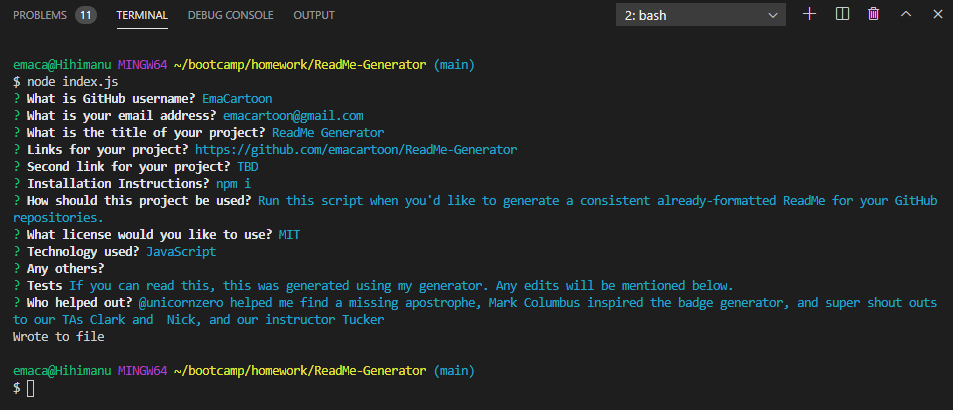

 
# ReadMe Generator
 
## Table of Contents
 
* [License](#license)
* [Links](#links)
* [Installation Instructions](#installation-instructions)
* [My Usage](#my-usage)
* [Technology Used](#technology-used)
* [Tests](#tests)
* [Mockups and Screenshots](#mockups-and-screenshots)
* [Questions](#questions)
* [Credits](#credits)
 
  
## License
 
* [](https://opensource.org/licenses/MIT)
  
## Links
 
* Github Repository: https://github.com/emacartoon/ReadMe-Generator
* Github Page: https://emacartoon.github.io/ReadMe-Generator
* Video Walk-through: https://drive.google.com/file/d/1AYRkMmf-2ZPRl9xjR3aQDHsSiDWSXilN/view
  
## Installation Instructions
 
After you clone down your repo, you will need to install Node.js in your environment. This should be easily achieved with:
 
```
npm i
```
 
To run the generator, use Node to run the index script:
```
node index.js
```
 
Follow the prompts in your Terminal, and a ReadMe.md file will be created in your main folder.
 
## My Usage
 
Run this script when you'd like to generate a consistent already-formatted ReadMe for your GitHub repositories.
  
## Technology Used
 
JavaScript
  
 
  
## Tests
 
If you can read this, this was generated using my generator. Any edits will be mentioned below.
- I formatted the Links afterwards to explain what they go to
- I manually added the video link that I recorded while generating this file
- I manually added the Screenshot below
- I also added a bit more information on the installation, explaining how to run the npm i, etc.
  
## Mockups and Screenshots


Screenshot of Terminal output
  
## Questions
 
If you have any questions about this project, or happen to use this project, please reach out to me!
Email: emacartoon@gmail.com
GitHub: @EmaCartoon
 
 
## Credits
 
@unicornzero helped me find a missing apostrophe, Mark Columbus inspired the badge generator, and super shout outs to our TAs Clark and  Nick, and our instructor Tucker